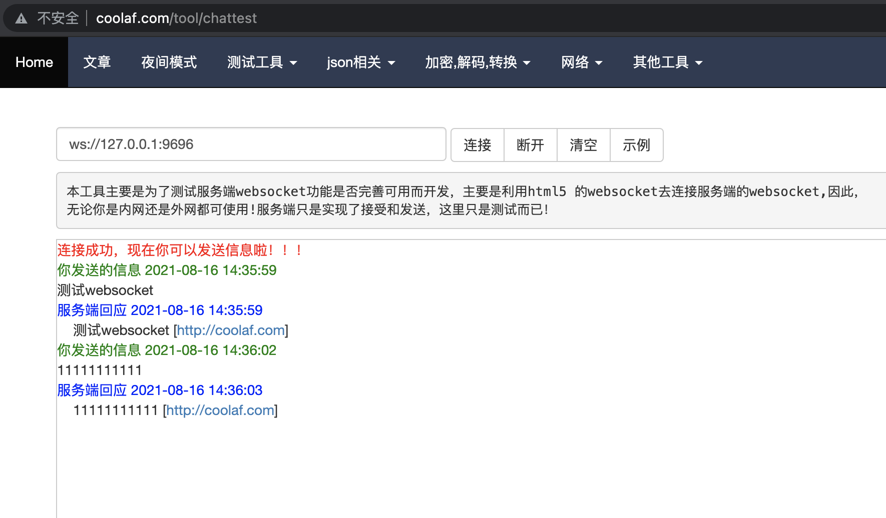

# websocket proxy

### 80行代码实现websocket代理功能，不依赖三方库，支持ws、wss代理

### 测试
> go run main.go

启动后监听`127.0.0.1:9696`端口，使用在线测试工具`http://coolaf.com/tool/chattest` 连接代理测试请求响应

### 示例


### 核心代码
```go
package main

import (
	"context"
	"crypto/tls"
	"io"
	"log"
	"net"
	"net/http"
	"net/http/httputil"
	"strings"
)

const (
	WSDailAddr    = "82.157.123.54:9010"        // 目标地址
	WSScheme      = "ws"                        // 协议类型， ws, wss
	WSDefaultPath = "/ajaxchattest"             // path地址
	WSOrigin      = "http://82.157.123.54:9010" // 伪装来源
)

var tlsc = &tls.Config{InsecureSkipVerify: true} // 不验证证书

func main() {
	http.HandleFunc("/", websocketProxy)
	err := http.ListenAndServe(":9696", nil)
	if err != nil {
		panic(err)
	}
}

func websocketProxy(writer http.ResponseWriter, request *http.Request) {
	if strings.ToLower(request.Header.Get("Connection")) != "upgrade" ||
		strings.ToLower(request.Header.Get("Upgrade")) != "websocket" {
		_, _ = writer.Write([]byte(`Must be a websocket request`))
		return
	}
	hijacker, ok := writer.(http.Hijacker)
	if !ok {
		return
	}
	conn, _, err := hijacker.Hijack()
	if err != nil {
		return
	}
	defer conn.Close()
	req := request.Clone(context.TODO())
	req.URL.Path, req.URL.RawPath, req.RequestURI = WSDefaultPath, WSDefaultPath, WSDefaultPath
	req.Host = WSDailAddr
	// 增加头部，权限认证 + 伪装来源
	req.Header.Set("Cookie", "---")
	req.Header.Set("Origin", WSOrigin)

	var remoteConn net.Conn
	switch WSScheme {
	case "ws":
		remoteConn, err = net.Dial("tcp", WSDailAddr)
	case "wss":
		remoteConn, err = tls.Dial("tcp", WSDailAddr, tlsc)
	}
	if err != nil {
		panic(err)
	}
	defer remoteConn.Close()
	b, _ := httputil.DumpRequest(req, false)
	remoteConn.Write(b)

	errChan := make(chan error, 2)
	copyConn := func(a, b net.Conn) {
		_, err := io.Copy(a, b)
		errChan <- err
	}
	go copyConn(conn, remoteConn) // response
	go copyConn(remoteConn, conn) // request
	select {
	case err = <-errChan:
		if err != nil {
			log.Println(err)
		}
	}
}
```


